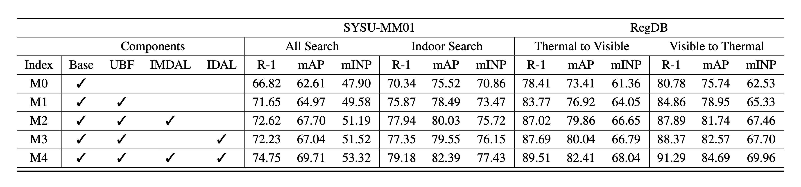
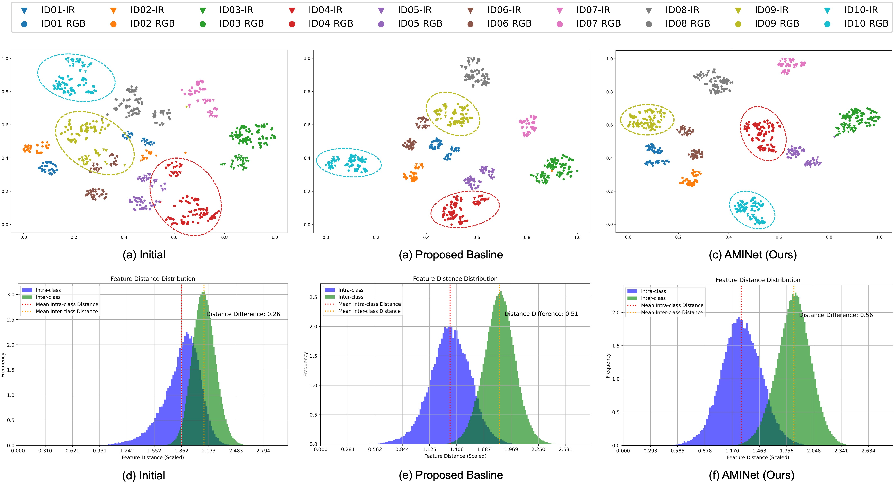

# AMINet-VI-ReID-CV-ML
Visible-Infrared Person Re-Identification (VI-ReID) with the proposed Adaptive Modality Interaction Network (AMINet). It mitigates modality gap, illumination changes and occlusion via feature learning and cross-modal alignment. It achieves 74.75% Rank-1 on SYSU-MM01, outperforming baseline by 7.93% and state-of-the-art by 3.95%.

## Overview

Visible-Infrared Person Re-Identification (VI-ReID) suffers from severe modality discrepancies between RGB and infrared images, along with challenges such as illumination variation and occlusion.

  

<b>Figure 1.</b> Overview of the proposed HMG-DBNet framework. The model adopts a dual-stream architecture to extract full-body and part-level features. IFFS performs intra- and cross-modality feature fusion to enhance RGB-IR alignment. PESAM introduces phase congruency and edge-guided attention for illumination-invariant structural representation. AMK-MMD further reduces cross-modal distribution discrepancy through adaptive multi-scale kernel alignment. The entire network is jointly optimized using ID loss, Triplet loss, and MMD loss for robust cross-modality person re-identification.

We propose **AMINet (Adaptive Modality Interaction Network)**, which improves cross-modal feature alignment through:

- **Hierarchical Multi-Granular Dual-Branch Network (HMG-DBNet)** Multi-granularity feature extraction(full-body + upper-body)
- **Interactive Feature Fusion Strategy (IFFS)** for intra- and cross-modality alignment
- **Phase-Enhanced Structural Attention Module (PESAM)** for illumination-invariant feature learning
- **Adaptive Multi-Scale Kernel MMD (AMK-MMD)** for robust distribution alignment

On SYSU-MM01, AMINet achieves **74.75% Rank-1 accuracy**, outperforming the baseline by **+7.93%** and previous SOTA by **+3.95%**.

# 4. Experiments

## 4.1 Experimental Setups

We evaluate the proposed method on two standard VI-ReID benchmarks: **SYSU-MM01** and **RegDB**, using **CMC, mAP, and mINP** as evaluation metrics.

### Datasets
- **SYSU-MM01**: 491 identities from 6 cameras (4 RGB + 2 IR). Evaluation includes all-search and indoor-search settings.
- **RegDB**: 412 identities with RGB-IR pairs, evaluated under both Visible→Thermal and Thermal→Visible modes.

### Implementation Details
The model is implemented in PyTorch and trained on an RTX 4090 GPU. The input resolution is set to 388×144 for the global branch and 194×144 for the part branch. The model is trained for 80 epochs with a batch size of 64. Optimization is performed using SGD with momentum 0.9 and weight decay 5e-4, and the learning rate follows a staged schedule (0.01 → 0.1 → 0.001).

###  Baseline Model. 
The baseline model (M0), which only
includes full-body feature extraction (Base) without any
additional modules, achieved 66.82% Rank-1 accuracy in
the SYSU-MM01 all-search mode and 70.34% in indoor-
search. On the RegDB dataset, it scored 78.41% Rank-1
accuracy in the Thermal-to-Visible mode and 80.78% in the
Visible-to-Thermal mode. These results indicate that us-
ing whole-body features alone limits the model’s ability to
handle cross-modality discrepancies, particularly under oc-
clusion and varying illumination.

## 4.2 Ablation Study

  

<b>Table 1.</b> Ablation study results showing the impact of different components (UBF, IMDAL, and IDAL) on Rank-1 accuracy (R-1), mean Average Precision (mAP), and mean Inverse Negative Penalty (mINP) across SYSU-MM01 and RegDB datasets.

## 4.3 Effect of Loss Weights

  

<b>Table 2.</b> Results with different intra-modality and inter-modality loss weights on SYSU-MM01 and RegDB datasets. The optimal weight setting varies across datasets due to different modality gaps: SYSU requires a balanced setting (0.4 / 0.6), while RegDB benefits from stronger inter-modality alignment (0.8).

## 4.4 Effect of Upper-Body Proportion

  

<b>Figure 2.</b> Impact of Upper Body Proportion (UBP) on model accuracy for SYSU-MM01 (left) and RegDB (right) datasets.  

The results in Fig. 2 show that cross-modality Re-ID performance is highly sensitive to the proportion of upper-body input. Optimal accuracy is achieved at 50% on SYSU-MM01 (74.15%) and 60% on RegDB (91.29%). Overall, a balanced range of 50%–60% provides the best trade-off, where discriminative local cues (e.g., shoulders and torso) effectively complement global full-body representations, improving RGB-IR alignment and overall robustness.

## 4.5. State-of-the-Art Performance Comparison

### Evaluation on SYSU-MM01. 

  

<b>Table 4.</b> Performance comparisons on the SYSU-MM01 dataset under both All Search and Indoor Search settings. Our method (AMINet) consistently outperforms existing state-of-the-art approaches across all evaluation metrics, including Rank-1, mAP, and mINP.

<b>Conclusion.</b> AMINet achieves strong and consistent improvements on SYSU-MM01, reaching 74.75% Rank-1 and 66.11% mAP in All Search, and 79.18% Rank-1 in Indoor Search. These results demonstrate superior RGB-IR feature alignment and robustness under both challenging and controlled environments.

### Evaluation on RegDB.

  

<b>Table 3.</b> Performance comparisons on the RegDB dataset under both Thermal-to-Visible and Visible-to-Thermal evaluation settings.

<b>Conclusion.</b> AMINet achieves state-of-the-art performance on RegDB, reaching 89.51% Rank-1 (Thermal-to-Visible) and 91.29% Rank-1 (Visible-to-Thermal). The results demonstrate strong cross-modality alignment capability and effective RGB-IR feature fusion under different sensing conditions.

## 4.6. t-SNE Visualizations & Feature Distance Distributions

  

<b>Figure 4.</b> t-SNE visualizations and feature distance distributions for different models, demonstrating cross-modality feature alignment and intra-/inter-class separability.

<b>t-SNE Visualization.</b> The t-SNE results demonstrate the evolution of feature embedding space across different models. The initial model shows clearly separated RGB and IR clusters with significant identity dispersion, indicating severe cross-modality misalignment. The baseline model improves clustering structure but still exhibits partial modality inconsistency. In contrast, AMINet produces compact and well-overlapped RGB-IR identity clusters, demonstrating strong cross-modality feature alignment and improved identity discriminability.

<b>Feature Distance Distributions.</b> The feature distance analysis further validates this improvement quantitatively. The initial model shows strong overlap between intra-class and inter-class distributions with a small margin (<b>0.26</b>), indicating weak feature separability. The baseline model reduces this overlap and improves class separation. Our full model achieves a significantly larger margin (<b>0.56</b>), with well-separated distributions and minimal overlap, reflecting stronger intra-class compactness and inter-class separability.

