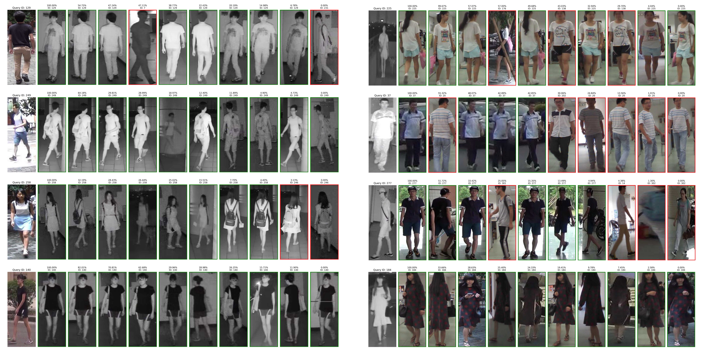

# AMINet-VI-ReID-CV-ML

Visible-Infrared Person Re-Identification (VI-ReID) with the proposed **Adaptive Modality Interaction Network (AMINet)**. It mitigates modality gap, illumination changes, and occlusion via hierarchical feature learning and cross-modal alignment. It achieves **74.75% Rank-1 on SYSU-MM01**, outperforming baseline by **7.93%** and state-of-the-art by **3.95%**.

  

<b>Figure 1.</b> Overview of the proposed HMG-DBNet framework. The model adopts a dual-stream architecture to extract full-body and part-level features. IFFS performs intra- and cross-modality feature fusion. PESAM introduces phase congruency and edge-guided attention for illumination-invariant structural representation. AMK-MMD reduces cross-modal distribution discrepancy via adaptive kernel alignment. The network is jointly optimized using ID loss, Triplet loss, and MMD loss.

## Framework Overview

Visible-Infrared Person Re-Identification (VI-ReID) suffers from severe modality discrepancies between RGB and infrared images, along with challenges such as illumination variation and occlusion.

We propose **AMINet (Adaptive Modality Interaction Network)**, which improves cross-modal feature alignment through:

* **Hierarchical Multi-Granular Dual-Branch Network (HMG-DBNet)**: multi-granularity feature extraction (full-body + upper-body)
* **Interactive Feature Fusion Strategy (IFFS)**: intra- and cross-modality feature interaction
* **Phase-Enhanced Structural Attention Module (PESAM)**: illumination-invariant structural representation
* **Adaptive Multi-Scale Kernel MMD (AMK-MMD)**: distribution-level alignment across modalities

On SYSU-MM01, AMINet achieves **74.75% Rank-1 accuracy**, outperforming the baseline by **+7.93%** and previous SOTA by **+3.95%**.

## Ablation Study 

  

<b>Table 1.</b> Ablation study of UBF, IMDAL, and IDAL on SYSU-MM01 and RegDB.

**Conclusion.** Each module contributes progressively. Full AMINet achieves best performance, confirming complementary effects.

## Performance Trends

  

<b>Figure 3.</b> Rank-1 and mAP trends on SYSU-MM01 and RegDB.

**Conclusion.** AMINet shows stable and consistent improvement across datasets, demonstrating robust optimization and generalization.

## State-of-the-Art Comparison

### SYSU-MM01

  

<b>Table 4.</b> SYSU-MM01 comparison results.

**Conclusion.** AMINet achieves **74.75% Rank-1** and **66.11% mAP (All Search)**, and **79.18% Rank-1 (Indoor Search)**, outperforming existing methods.

### RegDB

  

<b>Table 3.</b> RegDB comparison results.

**Conclusion.** AMINet achieves **89.51% (T→V)** and **91.29% (V→T)** Rank-1 accuracy, demonstrating strong cross-modality alignment.

## Representation Quality (t-SNE & Feature Distance)

  

<b>Figure 4.</b> t-SNE and feature distance analysis.

### t-SNE Visualization

Initial model shows severe RGB-IR misalignment. Baseline improves clustering. AMINet achieves compact and aligned identity clusters across modalities.

### Feature Distance Distribution

Initial model shows overlap with margin **0.26**. Baseline improves separation. AMINet achieves margin **0.56**, showing strong intra-class compactness and inter-class separability.

## Retrieval Visualization Results

  

<b>Figure.</b> This figure presents eight (two sets) randomly selected query instances from the SYSU-MM01 dataset, along with their corresponding top ten (Rank-10) retrieval results. The retrieval results are illustrated under two distinct query modalities: visible-to-infrared and infrared-to-visible. Correct matches are indicated by green bounding boxes, while incorrect matches are highlighted in red bounding boxes. The ID and the predicted similarity scores are shown above each image pair.

<b>Conclusion.</b> The retrieval visualization demonstrates that AMINet produces highly accurate cross-modality matching results under both query directions. Most top-ranked results correspond to correct identities, indicating strong RGB–IR alignment and robust identity discrimination capability, even under challenging modality variations.

## Effect of Upper-Body Proportion 

  

<b>Figure 2.</b> Impact of Upper Body Proportion (UBP) on SYSU-MM01 and RegDB.

**Conclusion.** Performance is highly sensitive to UBP. Optimal range is **50%–60%**, where local cues complement global features for better RGB-IR alignment.

## Effect of Loss Weights (Optimization Stability)

  

<b>Table 2.</b> Effect of intra-modality and inter-modality loss weights.

**Conclusion.** SYSU-MM01 prefers balanced weights (0.4 / 0.6), while RegDB requires stronger inter-modality alignment (0.8), indicating larger modality gap.

## Experimental Setups

We evaluate AMINet on two VI-ReID benchmarks: **SYSU-MM01** and **RegDB**, using **CMC, mAP, and mINP** metrics.

### Datasets

* **SYSU-MM01**: 491 identities (4 RGB + 2 IR cameras), evaluated under all-search and indoor-search settings.
* **RegDB**: 412 identities with RGB-IR pairs, evaluated under Visible→Thermal and Thermal→Visible modes.

### Implementation Details
The model is implemented in PyTorch and trained on an RTX 4090 GPU. The input resolution is set to 388×144 for the global branch and 194×144 for the part branch. The model is trained for 80 epochs with a batch size of 64. Optimization is performed using SGD with momentum 0.9 and weight decay 5e-4, and the learning rate follows a staged schedule (0.01 → 0.1 → 0.001).
